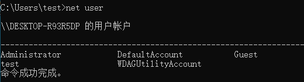
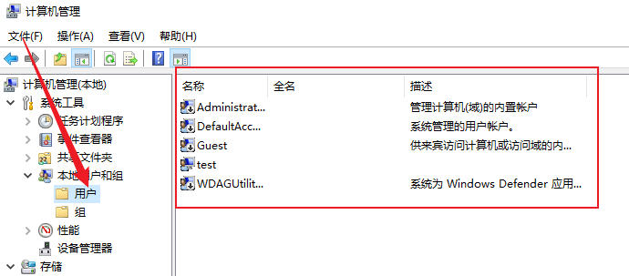
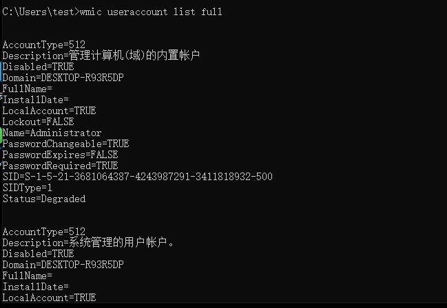
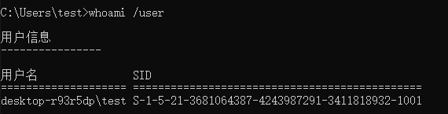
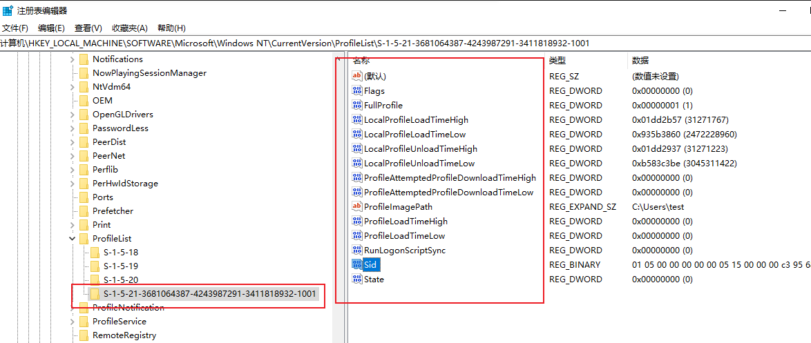
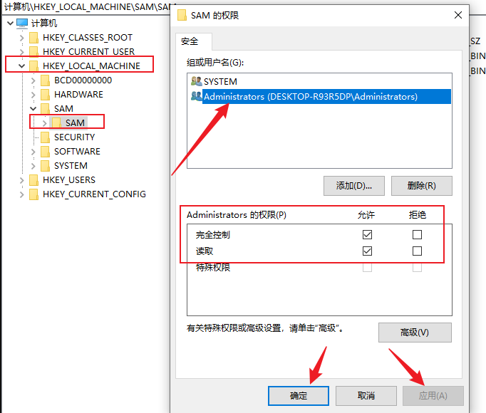
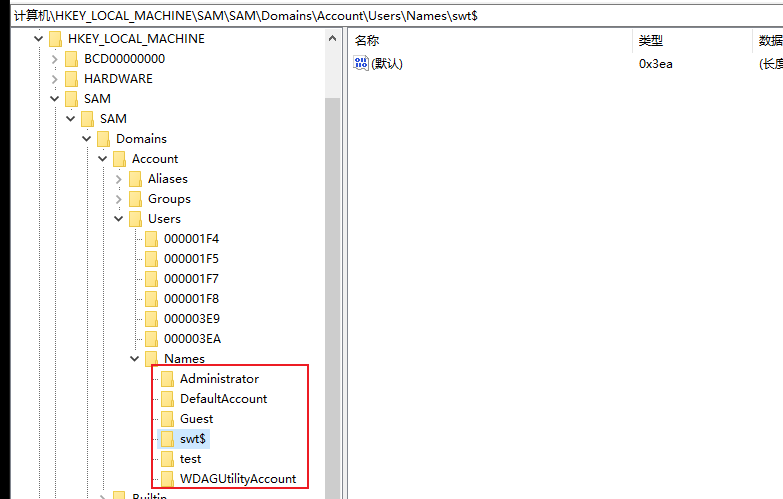

# Windows

## 本地用户分析

### 1，查

```bash
# 列出本地用户列表（此命令无需管理员权限，但是无法显示 隐藏用户，（如 admin$））
net user
```



```bash
# 通过图形界面查看本地用户
Win + X ，选择 “计算机管理”

# 或者通过运行对话框
Win + R ，执行 lusrmgr.msc
```



还可以通过 Win + R 执行 cmd 打开终端，执行以下命令

```powershell
wmic useraccount list full
```



最后是通过注册表的方式，win+r运行，输入cmd,输入命令regedit

1）方式一

首先通过终端执行命令

```bash
win + R --> cmd
执行 whoami /user
```



然后通过注册表编辑器找到如下路径：HKEY_LOCAL_MACHINE\SOFTWARE\Microsoft\Windows  NT\CurrentVersion\ProfileList，即可看到当前用户的标志信息：



2）方式二

通过 SAM 路径下查找





### 2，编辑

添加用户

```bash
net user 用户名 密码 /add
```

删除用户

```bash
net user 用户名 /delete
```

修改用户密码

```bash
net user 用户名 新密码
```

启用或禁用用户

```bash
net user 用户名 /active:yes
net user 用户名 /active:no
```

设置账户到期时间

```bash
# 设置账户在特定日期到期，设置为 never 表示永不过期
net user 用户名 expires:2026/12/31
```


