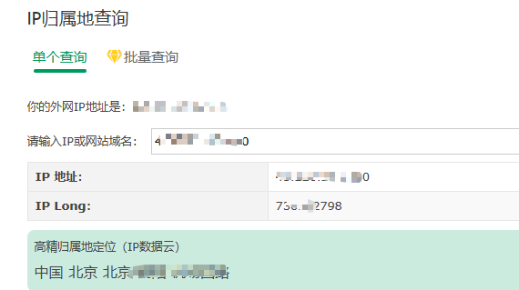
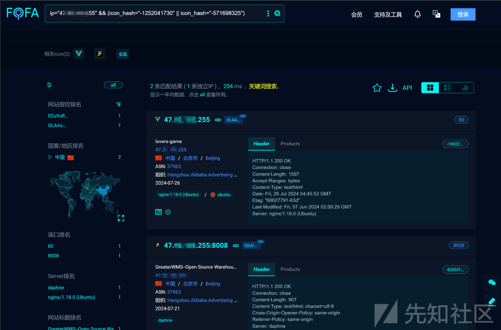
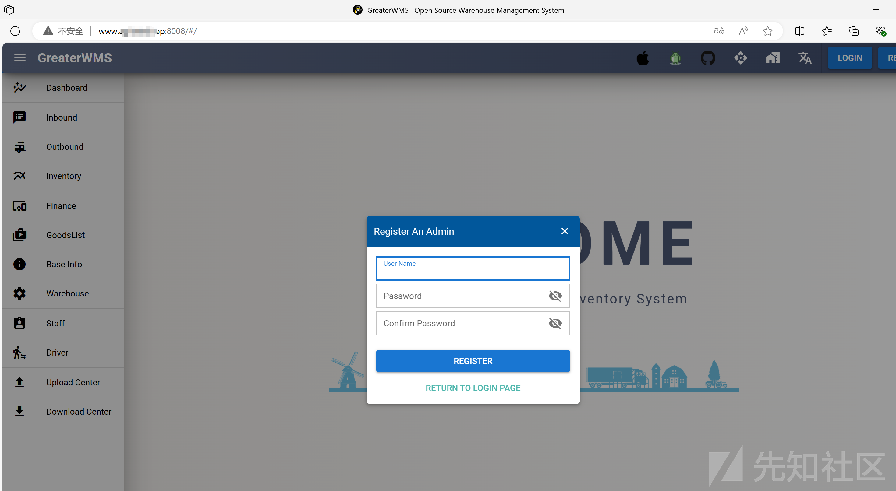
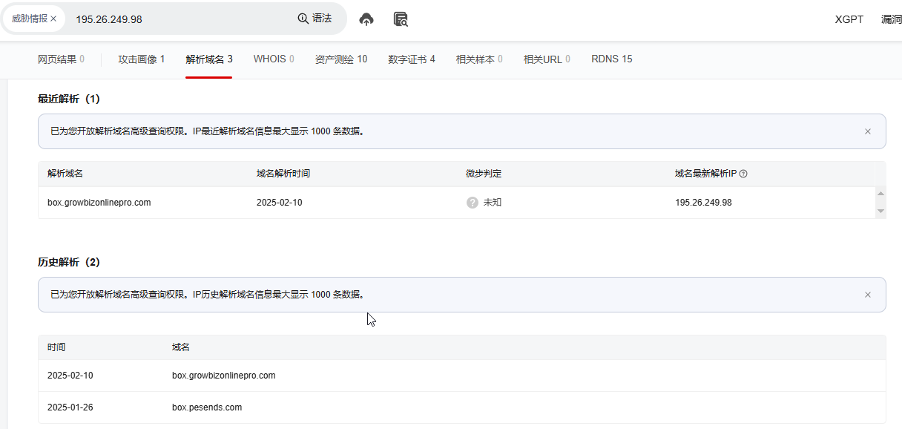
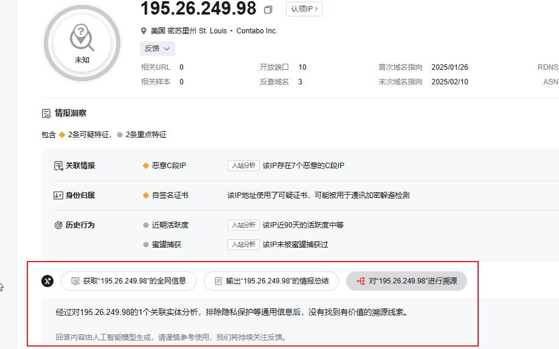
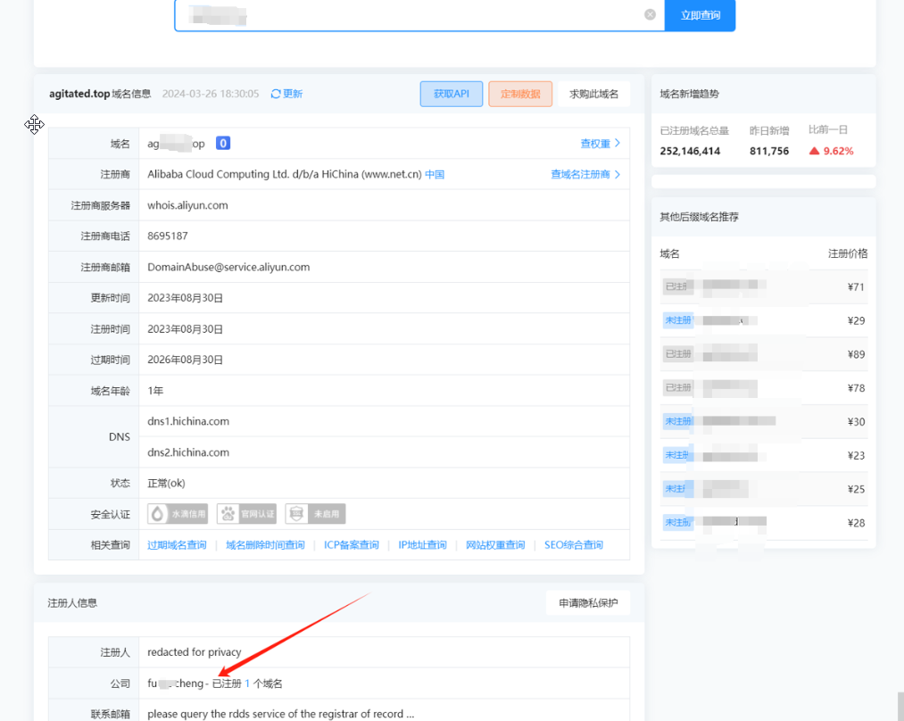
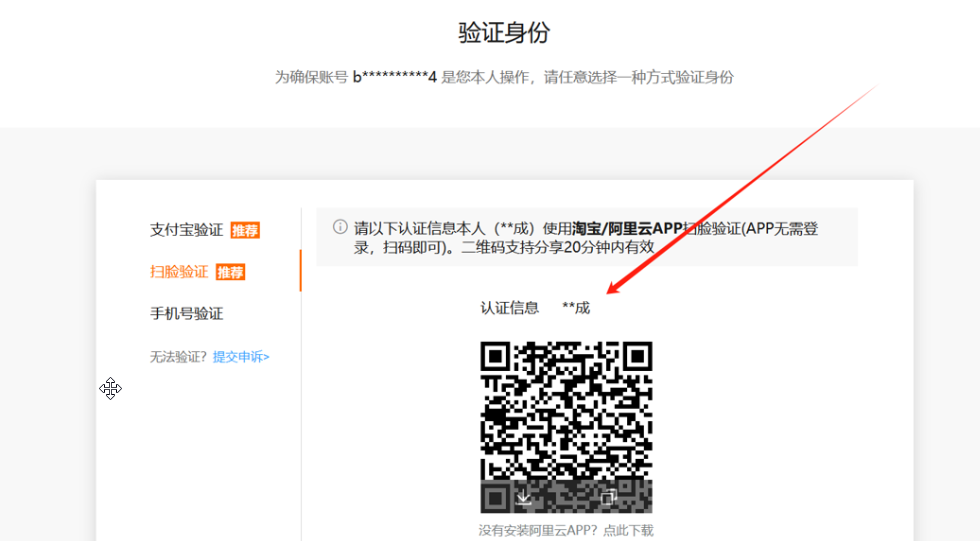
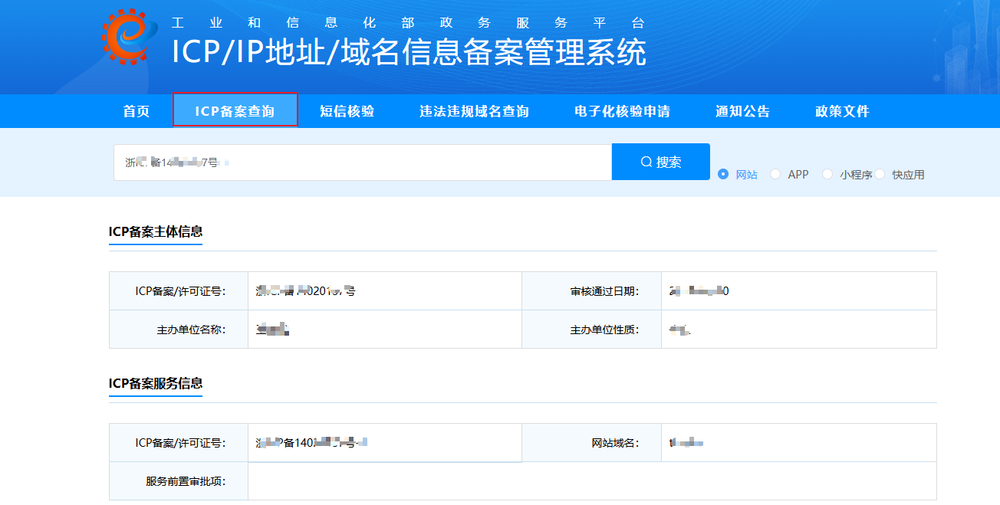
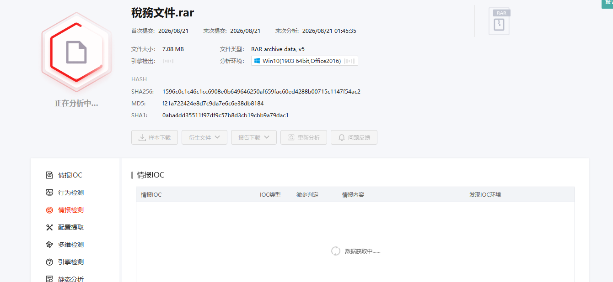

首先定位一下此***IP的归属地***：https://tool.lu/ip/index.html

我们直接fofa搜一下，看看有没有搭建什么网站，是否能够打进去拿到数据什么的，比如这个IP下还搭建过什么网站；

***FOFA***：https://fofa.so/

访问***GreaterWMS***仓库管理系统端口，发现该域名对应的IP

直接通过反查域名功能查看域名解析情况，发现存在多个域名解析问题，国内厂商阿里云，购买域名必须备案，浏览器使用域名访问下网站看下是否存在备案号啊，没有的话我们也可疑通过域名备案查询获取到网站所属用户信息

而且我们可以直接通过微步在线提供的溯源功能可简单的发现该IP的指向关系等信息；

***微步在线***：https://x.threatbook.com/

域名访问网站也能够发现备案号信息；

通过站长之家whois查询也可证明该网站的真实姓名信息：https://whois.chinaz.com/

通过***阿里云***找回密码功能验证姓名

***ICP备案查询***：https://beian.miit.gov.cn/#/Integrated/recordQuery

最后用***社工库***

使用***微步云沙箱***检测恶意文件尝试获取有用的信息：https://s.threatbook.com/

