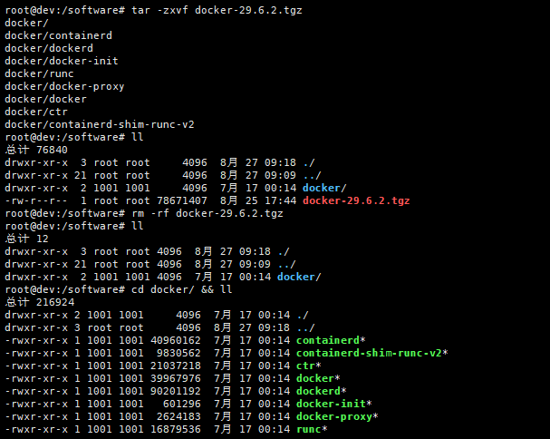

本章基于 Linux 系统 Ubuntu 22.04 安装，docker 版本 29.6.2

上传并解压tgz包至 /software/ 目录下



```bash
# 将二进制文件移动到可执行路径下的目录中，例如 /usr/bin/
sudo cp docker/* /usr/bin/

# 启动 docker 守护进程
sudo dockerd &

# 运行测试
docker run hello-world
```

